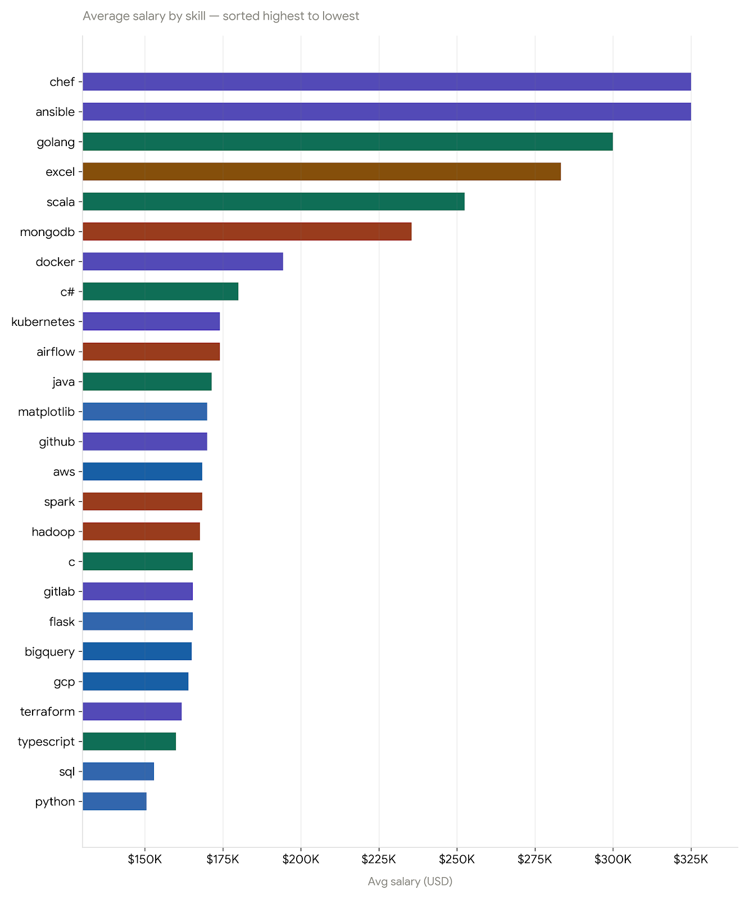

# Introduction
This project explores the most in-demand and highest-paying skills for Data Analyst roles in 2023. By analyzing job posting data, the goal is to identify industry trends, understand which skills command higher salaries, and uncover valuable career insights for aspiring data professionals.

SQL Queries Link: [project_sql folder](./04_project_sql/)

# Background

The analytics job market has become increasingly competitive, making it essential for professionals to focus on skills that provide the greatest return on investment.

### This analysis was conducted to answer several key questions:
1. What are the top-paying machine learning engineer jobs?
2. What skills are required for these top-paying jobs?
3. What are the top-demand skills for machine learning engineer jobs?
4. What are the top-paying skills for machine learning engineer jobs?
5. What are the most optimal skills for data analyst jobs?

# Tools I Used

### SQL
- Data extraction and transformation
- Aggregating skill demand and salary metrics
- Ranking and filtering high-value skills

### PostgreSQL
- Database management
- Query execution
- Data storage and analysis

### Antigravity
- SQL query development and execution
- Database exploration and analysis
- Visualization and reporting support
- Streamlined analytics workflow

### Git & GitHub
- Project documentation
- README creation
- Analysis presentation

# The Analysis

Each query for this project aimed to investigating specific aspect of the macine learning engineer and data analyst job market. Here how I approached each questions:

### 1. What are the top-paying machine learning engineer jobs?

I started by identifying the top-paying machine learning engineer jobs by selecting the top 10 jobs with the highest average salary. I used the `job_postings_fact` table to get the job title, salary and company name. I then ordered the results by salary in descending order and limited the results to the top 10.

```sql
SELECT job_id,
    job_title,
    job_location,
    job_schedule_type,
    salary_year_avg,
    job_posted_date,
    name AS company_name
FROM job_postings_fact
    LEFT JOIN company_dim ON job_postings_fact.company_id = company_dim.company_id
WHERE job_title_short = 'Machine Learning Engineer'
    AND job_location = 'Anywhere'
    AND salary_year_avg IS NOT NULL
ORDER BY salary_year_avg DESC
LIMIT 10;
```

### 2. What skills are required for these top-paying jobs?

To answer this question, I joined the `skills_job_dim` table with the `skills_dim` table to get the skills required for each job. I then selected the skills that appeared in the top 10 paying jobs and counted the number of times each skill appeared. I then ordered the results by the count of each skill in descending order and limited the results to the top 10.

```sql
WITH top_paying_jobs AS (
    SELECT job_id,
        job_title,
        salary_year_avg,
        name AS company_name
    FROM job_postings_fact
        LEFT JOIN company_dim ON job_postings_fact.company_id = company_dim.company_id
    WHERE job_title_short = 'Machine Learning Engineer'
        AND job_location = 'Anywhere'
        AND salary_year_avg IS NOT NULL
    ORDER BY salary_year_avg DESC
    LIMIT 10
)
SELECT top_paying_jobs.*,
    skills
FROM top_paying_jobs
    INNER JOIN skills_job_dim ON top_paying_jobs.job_id = skills_job_dim.job_id
    INNER JOIN skills_dim ON skills_job_dim.skill_id = skills_dim.skill_id
ORDER BY salary_year_avg DESC;
```
| Skill      | Frequency (Top 10 Jobs) |
 | ---------- | ----------------------- |
 | Python     | 8                       |
 | MongoDB    | 4                       |
 | Excel      | 3                       |
 | SQL        | 2                       |
 | Java       | 2                       |
 | AWS        | 2                       |
 | Kubernetes | 2                       |
 | Docker     | 2                       |
 | TensorFlow | 2                       |
 | PyTorch    | 2                       |

### 3. What are the top-demand skills for machine learning engineer jobs?

To identify the top-demand skills for machine learning engineer jobs by selecting the top 10 skills with the highest count. I used the `job_postings_fact` table to get the job title, salary and company name. I then ordered the results by the count of each skill in descending order and limited the results to the top 10.

```sql
SELECT skills,
    COUNT(skills_job_dim.skill_id) AS demand_skill_count
FROM job_postings_fact
    INNER JOIN skills_job_dim ON job_postings_fact.job_id = skills_job_dim.job_id
    INNER JOIN skills_dim ON skills_job_dim.skill_id = skills_dim.skill_id
WHERE job_title_short = 'Machine Learning Engineer' --AND job_work_from_home = true
GROUP BY skills
ORDER BY demand_skill_count DESC
Limit 5;
```

### 4. What are the top-paying skills for machine learning engineer jobs?

I identified the top-paying skills for machine learning engineer jobs by selecting the top 10 skills with the highest average salary. I used the `job_postings_fact` table to get the job title, salary and company name. I then ordered the results by the count of each skill in descending order and limited the results to the top 10.

```sql
SELECT skills,
    ROUND(AVG(salary_year_avg), 0) AS avg_salary
FROM job_postings_fact
    INNER JOIN skills_job_dim ON job_postings_fact.job_id = skills_job_dim.job_id
    INNER JOIN skills_dim ON skills_job_dim.skill_id = skills_dim.skill_id
WHERE job_title_short = 'Machine Learning Engineer'
    AND salary_year_avg IS NOT NULL
    AND job_work_from_home = true
GROUP BY skills
ORDER BY avg_salary DESC
Limit 25;
```

## Top 10 Highest-Paying Skills for Machine Learning Engineers (2023)

| Rank | Skill | Average Salary (USD) |
|------|---------|---------:|
| 1 | Chef | $325,000 |
| 2 | Ansible | $325,000 |
| 3 | Golang | $300,000 |
| 4 | Excel | $283,333 |
| 5 | Scala | $252,500 |
| 6 | MongoDB | $235,500 |
| 7 | Docker | $194,331 |
| 8 | C# | $180,000 |
| 9 | Kubernetes | $174,102 |
| 10 | Airflow | $174,064 |

### 5. What are the most optimal skills for data analyst jobs?

I listed all the most optimal skills for data analyst jobs by selecting the top 10 skills with the highest average salary. I used the `job_postings_fact` table to get the job title, salary and company name. I then ordered the results by the count of each skill in descending order and limited the results to the top 10.

```sql
WITH skills_demand AS (
    SELECT skills_job_dim.skill_id,
        skills,
        COUNT(skills_job_dim.skill_id) AS demand_skill_count
    FROM job_postings_fact
        INNER JOIN skills_job_dim ON job_postings_fact.job_id = skills_job_dim.job_id
        INNER JOIN skills_dim ON skills_job_dim.skill_id = skills_dim.skill_id
    WHERE job_title_short = 'Data Analyst'
        AND salary_year_avg IS NOT NULL
        AND job_work_from_home = true
    GROUP BY skills_job_dim.skill_id,
        skills
),
average_salary AS(
    SELECT skills_job_dim.skill_id,
        skills,
        ROUND(AVG(salary_year_avg), 0) AS avg_salary
    FROM job_postings_fact
        INNER JOIN skills_job_dim ON job_postings_fact.job_id = skills_job_dim.job_id
        INNER JOIN skills_dim ON skills_job_dim.skill_id = skills_dim.skill_id
    WHERE job_title_short = 'Data Analyst'
        AND salary_year_avg IS NOT NULL
        AND job_work_from_home = true
    GROUP BY skills_job_dim.skill_id,
        skills
)
SELECT skills_demand.skill_id,
    skills_demand.skills,
    skills_demand.demand_skill_count,
    average_salary.avg_salary
from skills_demand
    inner join average_salary ON skills_demand.skill_id = average_salary.skill_id
WHERE demand_skill_count > 10
ORDER BY avg_salary DESC,
    demand_skill_count DESC
LIMIT 25;
```
Here is the breakdown of these findings:

1. **Python, Tableau, and SQL remain the foundation of Data Analytics**
- Python and Tableau had the highest demand among job postings, showing that employers continue to value professionals who can analyze, automate and visualize data effectively.
2. **Cloud and Data Warehouse technologies command higher salaries**
- Skills such as Snowflake, Azure, AWS and BigQuery were among the highest-paying, highlighting the industry's shift toward cloud-based analytics and modern data platforms.
3. **Data Engineering skills create a competitive advantage**
- Technologies like Hadoop, Spark, NoSQL and SSIS indicate that analysts who can work with large-scale data pipelines and infrastructure often earn higher salaries than those focused solely on reporting and dashboards.


*Bar graph visualization of the top ML skills by average salary*


*Bar graph visualization of the top ML skills by average demands*


*Bar graph visualization of the top Data Analyst skills by average demands*
# What I Learned

Through this project, several important insights emerged:

- **Python** remains one of the most important skills due to its combination of demand, versatility, and salary potential.
- **Cloud technologies** such as Azure, AWS, Snowflake, and BigQuery are becoming core components of modern analytics workflows.
- **Data Engineering knowledge** can significantly increase earning potential.
- **Visualization and storytelling skills** continue to be essential for communicating insights effectively.
- **Employers increasingly seek analysts** who possess both business understanding and technical expertise.

Most importantly, this analysis reinforced that the highest-value professionals are those who **combine analytical thinking with modern technical skills**.

# Conclusion

This analysis highlights a significant transformation occurring within the Data Analytics profession.

The findings suggest that modern Data Analysts are evolving beyond traditional reporting responsibilities and becoming more technically versatile professionals capable of working with cloud infrastructure, large datasets, and automated analytics workflows.

For aspiring Data Analysts, a strong learning path would be:

**SQL → Tableau/Power BI → Python → Cloud Data Warehouses (Snowflake/BigQuery) → AWS/Azure → Data Engineering Fundamentals**

By aligning skill development with market demand, professionals can position themselves for higher-paying opportunities and long-term career growth in the analytics industry.

The analysis demonstrates that machine learning knowledge alone is no longer sufficient to maximize career opportunities. The greatest salary premiums are associated with professionals who combine machine learning expertise with software engineering, cloud architecture, and platform engineering skills.

For aspiring Machine Learning Engineers, a recommended learning path is:

**Python → SQL → Machine Learning Fundamentals → PyTorch/TensorFlow → Cloud Platforms (AWS/GCP) → Docker → Kubernetes → MLOps & System Design**

By developing both machine learning and infrastructure capabilities, professionals can build valuable career capital and position themselves for senior and high-impact AI engineering roles.

### Closing Thoughts

Building this project fundamentally **shifted my perspective on database architecture**. Diving deep into **SQL** and **PostgreSQL** went far beyond just learning syntax—it gave me a much clearer understanding of how to structure **reliable data models**, write **efficient queries** and handle **complex data loading procedures**. As a fresh Computer Science graduate, bridging this gap between software development and data engineering has been a massive step forward. It has equipped me with the foundational database skills I need to grow into an AI Engineer role in the future, where **clean, well-structured data pipelines** are just as critical as the machine learning models themselves.
